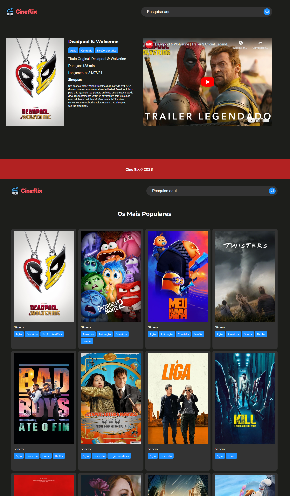

  

# Cineflix
Cineflix é um aplicativo para filmes feito com React. No app é possível encontrar informações sobre os filmes mais populares e também buscar por um título específico. Este projeto utiliza rotas e se comunica com uma API de terceiros para obter os filmes. A obtenção de dados é feita usando a função nativa do JavaScript, fetch.

## Stack Utilizada:
- react v18 
- react-router-dom v6.8
- react-youtube v10
- typescript v4.9

## Requisitos:
- Cadastro no site: https://www.themoviedb.org
- Criar um arquivo .env com a chave de acesso da\
API (utilize como base o arquivo .env-example).

## Principais Scripts
- npm start: Inicia modo de desenvolvimento.
- npm run build: Cria um aplicativo para produção\
na pasta build.

---

  

