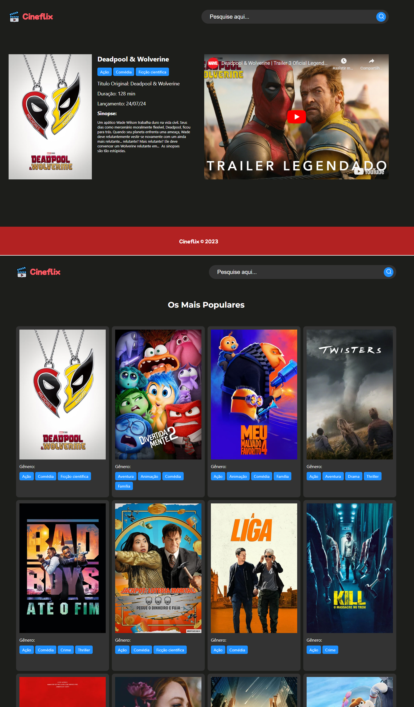

<div align="center">
  <a href="https://react.dev/" target="_blank"></a>
</div>

# Cineflix

O **Cineflix** é uma aplicação desenvolvida com **React** e **Vite** que permite explorar filmes, visualizar informações detalhadas e assistir aos trailers utilizando a API do **The Movie Database (TMDb)**.

## Conceitos abordados

- ContextAPI
- Rotas (React Router)
- Custom Hooks
- Busca de Dados de API de Terceiros(The Movie Database)

## Rotas

```markdown
/ - listar os filmes.

/movie/{id} - recupera um determinado filme.

/search?q={movie} - recupera o filme pesquisado.
```

## Stack Utilizada:

- react v18
- react-router-dom v6.26
- react-youtube v10.1
- typescript v5.5

## Requisitos:

- Cadastro no site: https://www.themoviedb.org
- Criar um arquivo .env com a chave de acesso da\
  API (utilize como base o arquivo .env-example).

## Principais Scripts

- npm start: Inicia modo de desenvolvimento.
- npm run build: Cria um aplicativo para produção\
  na pasta build.

##

<div align="center">
  
</div>
